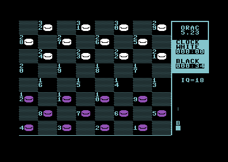
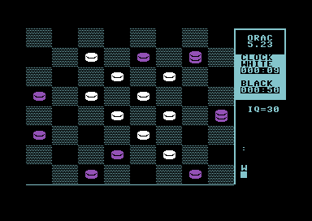

## DRAUGHTS SOFTWARE

Below are details on some different checkers playing engines I have written over time.
## DYNAMO DRAUGHTS 
DYNAMO DRAUGHTS is a program that plays International 10x10 draughts and related variants. It was widely featured on many magazine cover disks and shareware libraries back in the 1990s. The original DOS version is included, together with a text version for win32 and linux, which works with C99 compatible compilers.

Download dynamo v9.18 with source:
  <https://github.com/orac81/Orac-Draughts/raw/main/dyna918a.zip>
  
You can view more details and a manual here:
<https://github.com/orac81/Orac-Draughts/blob/main/dynamo.txt>

Screenshot:


## ORAC DRAUGHTS


ORAC is a (fairly) strong open-source 6502 checkers playing program. Its was originally written a long time ago for the PET, then later adapted for the Commodore 64, C16/+4 and VIC20. 

<https://github.com/orac81/Orac-Draughts/raw/main/orac523.zip>

Main files in this archive:

```
  orac-c64.prg   - Commodore 64 version.
  orac-c16.prg   - Commodore 16/Plus 4 version.
  orac-pet.prg   - Commodore PET version. (BASIC 2.0, PET 30xx/2001)
  orac-vic8k.prg - Commodore VIC20 8k+ version.
  orac-vic5k.prg - Commodore VIC20 unexpanded version (PETSCII only) (just 3300 bytes!).
  orac88pet.prg  - Original PET version, written and hand-patched on a PET.
  orac.s         - Source code for above, compiles with CA65 or ASM502. Released as free under GPL3 licence.
  orac.txt       - This document. Includes quick tutorial on checkers.
```


***

### COMMAND SUMMARY

```
Cursor up/down/left/right & SPACE - Move cursor and select move. (first the piece to move, then destination)
#-# - Enter your move using square numbers. (ie. 11-15 <RETURN>) 
N   - Put the square numbers up on the screen. Hit <RETURN> to clear numbers.
I#  - Set an intelligence (IQ) level. (ie. I20<RETURN>, range 0 to 39)
H   - Show HELP screen.  (H <RETURN>)
R   - Resign and Restart a new game.
A   - Auto play, tells ORAC to play ORAC. To stop this feature, hit RETURN.
G   - Makes ORAC take your move and swap sides.
P   - Makes ORAC skip your go and play again with his colours.
X   - Swap side to move.
S#  - Save board into one of 8 memory slots, ie. S1<RETURN>, range 0 to 7.
L#  - Loads one of 8 board positions from memory, ie. L1<RETURN> 
C   - Clear the board, ready to set up a position. 
B#  - Puts a black man on a given square. (ie: B5<RETURN>)
BK# - Puts a black king on a given square.
W#  - Puts a white man on a given square.
WK# - Puts a white king on a given square.
E#  - Erase piece at a given square.
V   - Toggle different graphic shapes for black pieces.
M#  - Set a randomisation factor. Bigger for more random the play. M0=off, M1 default. (M0 .. M15 <RETURN>).

F1  - Change the foreground colour. (F1 key)  (C16: CTRL-D)
F3  - Change the background colour. (F3 key)  (C16: CTRL-E)
F5  - Change white piece colour.    (F5 key)  (C16: CTRL-F)
F7  - Change black piece colour.    (F7 key)  (C16: CTRL-G)
```

***

### PLAYING THE GAME

You can enter your move by using the Cursor keys to move up/down/left/right, then hit SPACE to select the piece you want to move. Repeat to select the destination square. You can also make moves by typing in the from-to square numbers, followed by RETURN. To show the square numbers, hit N <RETURN>. When playing the game, remember that IF YOU CAN JUMP, YOU MUST! This is a very important rule. For a short tutorial on playing the game, see the end of this document. 

The C64 version, when thinking, shows on the right the best move so far, its eval in hex, and at the bottom a node count in hex.The eval is a two byte integer, about $8000 for an even game, higher for a black win, lower for a white win, etc. It uses the usual game searching methods - Alpha/Beta pruning, short-look ahead to sort move ordering, and so on. The IQ setting determines the search depth, about 4 IQ points for each ply, however jumps do not count as a ply, and are scanned deeper.   

In end games (with Kings) Randomisation will improve ORAC's play, try setting M3 up to M15 <RETURN> if ORAC is repeating moves in a winning position. When you first run ORAC, there are 8 sample problems to try - L0 .. L7 <RET> loads them, white to play and win.

To get a quick idea of the game, try running ORAC using the auto-play feature (A command) from a new board with different IQ settings.


### TECHNICAL DETAILS
 
Compiling ORAC is simple: using my own open source assembler ASM502:
   asm502 orac.s orac.prg >orac.lst    

Also compiles with the widely used assembler CA65 (part of the open source CC65 C compiler):
   ca65 -D USE_CA65=1 orac.s
   cl65 -t none -o orac.prg orac.o				# If you set the "-t" computer type, you dont need the "-D USE_CA65=1" fixup

You can change features by changing these defines in the code:
 
```
.define USE_HIRES    1		; Set to 1,2.. to use different Hi-res chrsets, =0 for PETSCII (Needed for PET). 1=C64/C16, 2=VIC20..
.define SMALLER_CODE 0		; Set this to take out some routines (Title screen, Brd Save/load etc)
.define SHOW_MOVE_INFO 1	; Set to add code to show best move, eval, node count etc..
.define USE_CLOCK    1		; Set to add chess style clock display.
.define NEW_FRONTEND 0		; Use smaller frontend board (=2 small, info underneath) (NEEDED for VIC20).. (0 for PET/C16/C64)
.define USE_COLOR    1		; Set to use color graphics (0 for PET)
.define USE_SOUND    1		; Enable simple beep sound on move (=1 click, =2 long beep)
.define USE_CURSOR   1		; Allow use of cursor+space to select moves.
.define USE_RANDMODE 1		; Use randomisation to improve play variety (M0..M15 set random factor)
.define V20_RELOC    0		; Set to make 8k VIC ver relocate to $1C00.. (needed for V20 hires)
   ; You can set just ONE of these..
.define IS_C64 1		; CBM64
.define IS_PET 0		; PET Basic 2 (2001/30xx) (NOTE Set: USE_COLOR 0, USE_HIRES 0)
.define IS_C16 0		; CBM16/+4  
.define IS_V20 0		; VIC20 8k+.  (NOTE Set: USE_HIRES 2, NEW_FRONTEND 1, V20_RELOC 1)  (When loading use LOAD"ORAC-VIC8K",8)
```

As things stand this program is still a "work in progress" - you might say somewhat slow progress! ORAC was fairly strong for its day, in testing it beat other 8 bit commercial offerings like the Fidelity Checker Challenger stand alone machine. But in reality there is plenty of room for improvement, particularly in the endgame, which is rather weak. Detection of position repetition, which requires storing all game moves, would greatly improve play. Also simple endgame databases could be implemented, for example 1 king vs 1 king lookup is about 200 bytes (32x32/5) plus access code. On larger 6502 platforms, small transposition tables would improve performance. Of course these days there are very strong checker programs for modern platforms in the public domain, do bear in mind that a modern PC is over 1000 times faster than a 6502 PET/C64/VIC computer - ORAC is from a different time. (ORAC was first advertised in PCW, June 1981!)

The original PET version is included here (ORAC88PET.PRG), its runs on PET BASIC 2.0 (2001/30xx) type machines. It was written using an early home-made assembler, with patches hand assembled and applied later, so its a bit of a mess. I had to "resource" and untangle this for the C64/VIC/C16 version, although more work is needed. I tried to keep the original 6502 engine functionally the same for now, which makes bug checking easier. I moved some critical engine variables to zero page (board etc), which improves speed by 10% or so. This code is also smaller, needing about 3-5K or so. The PET version (ORAC88PET.PRG) randomises selection of moves if they are of equal value, which is best for actual play. For testing it is possible to disable randomisation by typing: POKE 6409,96  after loading but before RUN. If you turn off ramdomisation in the new version (M0) it should play the same!

The PET version has vestiges of an interesting feature I tried in an early version (see memory location $192f). It would scan the board in 5 square "X" patterns (like a 5 on a dice) and, using 3 possible square values (white, black, empty) use a lookup table of 243 (3^5) bytes to get a "score" for that particular pattern. This little bit of 6502 asm is an early example of pattern recognition code. It didnt really seem to work well with ORAC, I didnt see a gain in performance, and it slowed down the search, so I patched it out. But I note that more advanced versions of this (with more sophisticated/bigger patterns, more memory, faster computers etc) seem to be used with success in more recent game playing programs.

Now follows a short tutorial on the game, since checkers is not so widely played these days. I hope you find ORAC fun, and maybe useful. Enjoy!

***

### INTRODUCING THE GAME OF DRAUGHTS
 
Draughts (or Checkers) is a much under rated and neglected game, often derided as a 'kids' game, and looked down upon by exponents of games like chess. This view is unjustified, as the game offers characteristics and subtleties simply not found in any other board game. And despite of over 200 years of research and analysis of the game, there is still plenty of new play to be found by the adventurous player. In a way, the virtue of the game is actually in its limited piece movement and mobility, since this forces you think in terms of warding off threats at a much deeper level than you would do in a game like chess, that has a larger mobility. Back in the day, there were clubs, tournements, magazines and even newspaper columns dedicated to the game. Let us look at the rules...

```
 +----------------+       
 |::32::31::30::29| 
 |28::27::26::25::|
 |::24::23::22::21|
 |20::19::18::17::|
 |::16::15::14::13|
 |12::11::10:: 9::|
 |:: 8:: 7:: 6:: 5|
 | 4:: 3:: 2:: 1::| 
 +----------------+
```



DRAUGHTS is traditionally played on the BLACK squares of an 8 by 8 chess board The squares are numbered from 1 (bott right) to 32 (top left), with black men on squares 1-12 and white on squares 21-32. Men move diagonally forward onto empty squares, or jump over and capture an opponent if there's a clear space behind it. One VERY important rule - IF YOU CAN JUMP, YOU MUST! If, after jumping, the same piece can jump again, IT MUST! One exception to this rule - when a man reaches the KING-ROW (the 8th), and is made into a KING, it may NOT make any further jumps - until the next move! When a man becomes a KING, it can move in all 4 diagonal directions. When one side has no legal moves left, that side loses the game! The most important rule is that if you can jump YOU MUST! This leads to fascinating combinations, often sparked by cunning material sacrifice. 

Consider this problem:- Black Man on 4, Black king on 6, White men on 7 and 12. Black to play and win. To set this up in ORAC type: C <RETURN> B4 <RETURN> BK6 <RETURN> W7 <RETURN> W12 <RETURN> .

(or B 4,K6 : W 7,12 in standard notation.) 
The winning move is 4-8! White MUST jump 12x3, its man at 3 becoming a king. Now black moves his king 6-2!! White now only has 1 move, 3-8, since its man at 7 cannot move, and Black simply jumps the 2 pieces 2x11x4 and wins! 

Here is another problem: 

B 1,2,6 : W 11,18,27 with Black to play & win. The key move for black is 2-7 !! White replies 11x2, and the new king HAS to stop at 2 to be crowned, it cannot go on and make further jumps. Black now plays 1-5, White must jump 2x9 and black wins with 5x14x23x32. 

Now a harder problem: 

W 6,10,14,15,18,19,22,23,27 

B 1,3,7,12,K13,20,K25,26 White to play and win. (Composed by World champion Derek Oldbury) 



ORAC can see the 17 move solution in a few minutes on IQ30: 27-24! 20x27, 14-9, 7x14, 15-11, 1x10, 11-7, 13x6, 18x9x2, 25x18, 23x14, 10x17, 19-16, 3-10, 2-6, 12x19, 6x15x24x31x22x13 and White wins.

OK, having done something to convince you of the beauty of the game, let us backtrack, and consider how you should approach actual play. In the broadest terms, getting a man up, without your opponent having any compensating advantage, will usually win you the game. In the opening, beginners often lose pieces by pushing them forward too far and too fast - this happens when you initiate an exchange. For example, if Black starts a game 11-15 and White replys 22-18, after the exchange 15x22, 25x18, you will see that the piece on 18 is thrown forward - in effect White has gained 2 extra 'steps' or tempi with his pieces. While forcing pieces forward like this is OK in the later stages of the game, when you able to break through your opponents defences, it can be dangerous early on. In fact, the opening just described is perfectly sound for White, but if White was to initiate further exchanges, he could rapidly run out of space, and find himself unable to protect his forward men. 

Another common mistake is to break up your back rank WITHOUT FORCING YOUR OPPONENT TO DO THE SAME. Your back rank is protection against your opponent getting a king, and also provides some protection against piercing shots and combinations. So, for Black, it is a good idea to keep the pieces at 1,2,3,6,7 intact for as long as possible. Note that I have excluded squares 4 & 8 - these are the SINGLE CORNER squares, and it is usually safer to evacuate these squares at an early stage - it is hard to get through for a king here, and even when you do, the king can often be held by a defender at square 3. By contrast, you should take particular care to defend your DOUBLE CORNER squares at 1 & 5 - this is a good place to break through for a king. For this reason, black will often keep men at 1 & 3 right through until the late stages of a game - this is called the BRIDGE defence. White usually has to place a man on square 10 before he can march through for a king. The BRIDGE can also tie up white men at square 12 (3 holds it) and 5 (1 holds it) - these are called the DOG-HOLES, and white should avoid going into these squares if at all possible. A good way to for White to attack Black's double corner is by occupying or controlling squares 14, 18 and 23 - this line-up is called the DYKE formation. Of course all the above applies equally WHITE'S back defence squares as well - for instance the White BRIDGE is at squares 30 & 32. The great emphasis on defence underlines the power of the King - an unhindered King behind your opponents defences can wreak havoc. To get to grips with the game, let us examine openings - first let us look at Black's opening moves, strongest first.

11-15 - Considered to be Blacks strongest - dominating the center. 23-19, 8-11, 22-17 often follow.

11-16 - The BRISTOL also good for black, often followed by 24-20, 16-19 with black attacking 19.

9-14 - The DOUBLE-CORNER - often followed by 22-18,5-9,25-22 with many traps awaiting white.

10-15 - The KELSO - While superficially looking strong, it does tend to jam up Black's single corner 10-14 - The DENNY, an even opening, often followed with 22-18, 11-16.

12-16 - The DUNDEE - weak for black, since 24-20 cramps his Single Corner.

9-13 - The EDINBURGH - while traditionally considered weak for black since White's 22-18 grabs the center, modern analysis reveals later counterplay for Black if played correctly.

The 11-15 move deserves special consideration - it is draughts equivalent to E2-E4 in chess! White has 7 replies, all of them good! In descending order of strength they are 23-19, 22-18, 22-17, 23-18, 24-19, 24-20, 21-17. Here are some mini-games illustrating traps in the classic openings - try them out on ORAC..

- 11-15,22-18, (Single corner opening) 15-22,25-18,8-11,29-25,4-8,25-22,12-16,24-20,10-15,27-24?? This is the Draughts equivalent of 'Scholar's Mate' - its called the Goose Walk. 15-19! 24-15,16-19,23-16,9-14, 18-9,11-25,28-24,5-14, and Black wins.
- 11-15,23-19,8-11,22-17,4-8, (Old fourteenth opening) 17-13,15-18,24-20,9-14,26-23,10-15,19-10,6-15,28-24, 12-16?? Black is too aggressive! 23-19! 16-23,20-16,11-20,25-22,18-25,27-4 and White wins.
- 11-15,23-19,9-14,27-23, (Defiance opening) 8-11,22-18,15-22,25-9,5-14,29-25,11-15,25-22,4-8,24-20,15-24, 28-19,8-11? Dangerous! 22-18,6-9,31-27,10-15?? Trying to be too clever 19-10,2-6,18-15! 11-18,30-25,6-15, 21-17,14-30,23-5,30-23,27-2 and White wins.
- 11-15,23-18 (Cross opening) 8-11,26-23,10-14,30-26,7-10,24-19,15-24,28-19,11-16,22-17,4-8,26-22,9-13? This strong looking move loses.. 18-9,5-14,19-15,10-26,17-10,6-15,22-17,13-22,25-4 and White king wins..
- 11-15,24-19,15-24,28-19 (Second Double Corner opening) 9-14,22-18,5-9,26-22,7-11,27-24,3-7,22-17,11-15, 18-11,8-15,25-22,9-13,23-18? White attempt for a king backfires 14-23,17-14,10-26,19-3,12-16,31-22,16-20, 24-19,2-7,3-10,6-24 and Black wins.
- 10-14, (Denny opening) 23-19,11-16,26-23,9-13,24-20? This loses to 14-17! 21-14, (20-11,17-26,31-22,8-31 loses) 6-10,20-11,10-26,31-22,8-31 and Black wins.
- 10-15, (Kelso opening) 23-19,6-10,22-17,11-16?? a loser! 17-13!, 16-23, 13-6, 2-9,27-18-11-2 and White wins.

-----

The source code is released as free software under the GNU GPL3 licence, see GNU website:      www.gnu.org/licenses/gpl-3.0.html 
